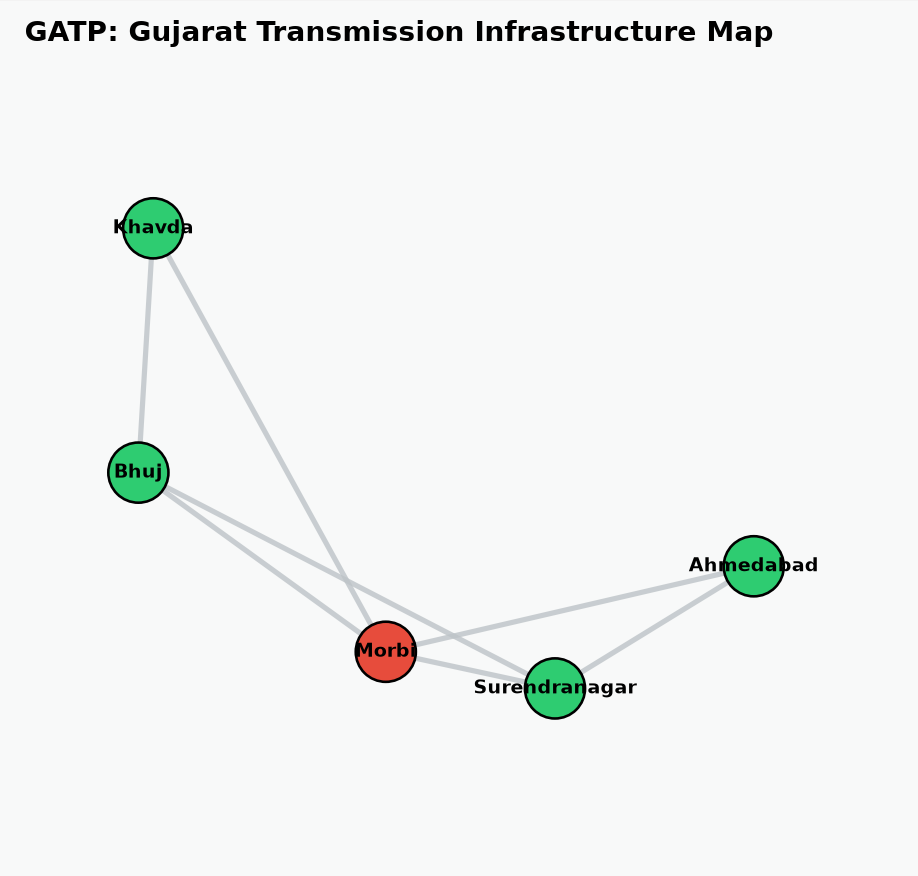

# Grid Absorption & Transit Protocol (GATP) ⚡

**A Full-Stack C++ & Python Engine for National Energy Infrastructure Optimization**

GATP is a high-performance routing and failover system designed to solve the multi-billion-dollar Right of Way (RoW) bottleneck in the renewable energy sector. By shifting from standard "shortest physical path" algorithms to dynamic, sociologically-weighted heuristics, GATP mathematically minimizes farmer protests, legal injunctions, and stranded energy costs during high-tension transmission line construction.

---

## 🛑 The Core Infrastructure Bottleneck
Renewable mega-parks are generating power faster than the grid can absorb it. Building 765kV transmission corridors requires planting massive steel towers on agricultural land, leading to:
* **Severe Sociological Friction:** Multi-crop farmers aggressively protest land acquisition.
* **Legal Paralysis:** Court injunctions halt construction for 1.5 to 3 years.
* **Stranded Energy:** Millions of dollars of generated solar/wind power are wasted daily.

## 💡 The GATP Solution 
Instead of routing power lines using direct physical distance, GATP utilizes a custom **A* Search Algorithm** backed by a **Sociological Heuristic Engine**. The engine calculates the true "Composite Weight" of a route by evaluating physical engineering costs, state jurisdiction taxes, and farmer protest probability models.

---

## ⚙️ Three-Tier System Architecture 

### 1. The C++ Algorithmic Backend
* **Pre-Emptive Routing:** Uses **A* Search** to find the most cost-effective, lowest-risk infrastructure paths, automatically bypassing high-protest farming zones.
* **Max-Flow Failover Engine:** Uses the **Ford-Fulkerson Algorithm (BFS)** to simulate catastrophic transmission line failures (e.g., towers collapsing) and instantly calculates how to safely reroute megawatts of live power through backup grid corridors.

### 2. The Big Data I/O Layer
* The system is completely decoupled from hardcoded logic. It features a custom C++ File Parser that reads dynamic `nodes.csv` (geographic/risk data) and `edges.csv` (infrastructure capacity) files, allowing for massive scalability without recompiling the core engine.

### 3. The Python Geospatial Visualizer
* A Python `NetworkX` and `Matplotlib` layer that parses the C++ data outputs and renders a mathematically accurate, color-coded topological map of the infrastructure network.

---

## 📊 Geospatial Network Map
*(Green = Standard Clearance | Red = Critical Sociological Friction)*



---

## 🚀 Live Executive Output
The C++ engine runs an interactive CLI allowing the user to select starting and destination infrastructure nodes via text parsing. It automatically contrasts the standard industry route against the algorithmically optimized route.

> **[BASELINE]: Traditional Direct Route**
> * Baseline Cost Estimate: ₹15.51 Billion
> * Risk Profile: CRITICAL (Severe multi-crop farmer protests expected)
>
> **[ALGORITHM]: Optimized Route Discovered**
> * Optimized Project Cost: ₹10.78 Billion
> * Financial Savings: **₹4.73 Billion**
> * Routing Sequence: Khavda -> Bhuj -> Surendranagar -> Ahmedabad

---

## 🛠️ Tech Stack 
* **Backend:** C++14/C++17 (Adjacency Lists, Min-Heaps, Pointers, File I/O)
* **Algorithms:** A* Search, Dijkstra's Variation, Ford-Fulkerson (Max-Flow)
* **Visualization:** Python 3 (Pandas, NetworkX, Matplotlib)

**To compile and run locally:**
```bash
g++ main.cpp -o gatp_core
./gatp_core
